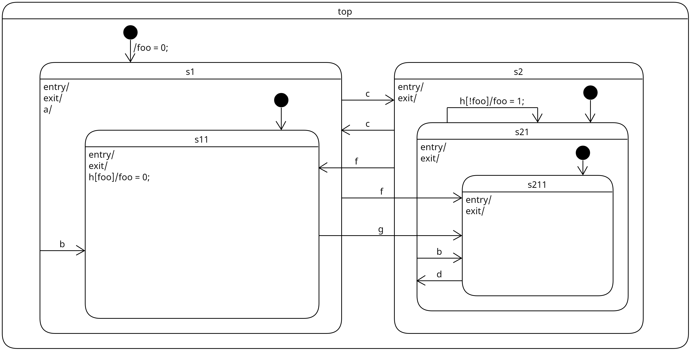

# hsm_engine
- `hsm_engine.c`, `hsm_engine.h`
  - Base module for hierarchical state machines
- `test_hsm.c`, `test_hsm.h`
  - Example state machine built with `hsm_engine`
- `main.c`
  - Example program: send events to `test_hsm` from your keyboard

## Example: test_hsm

## Todo
- Add unit tests!
